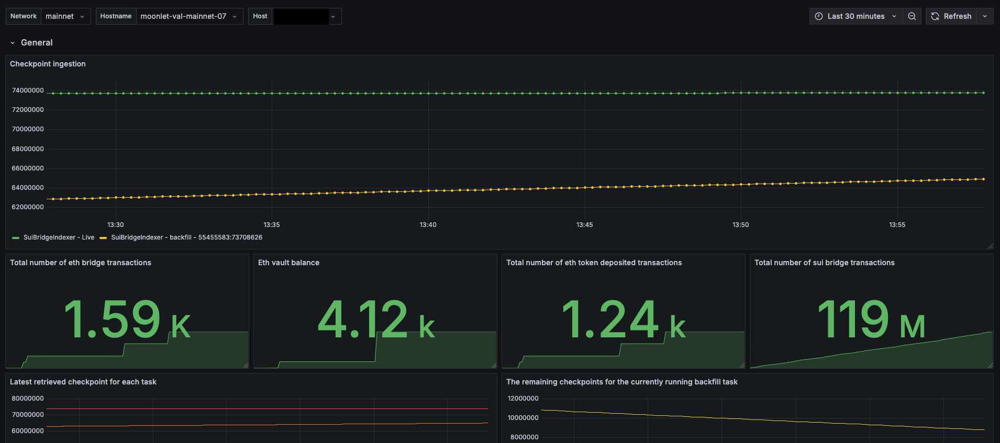
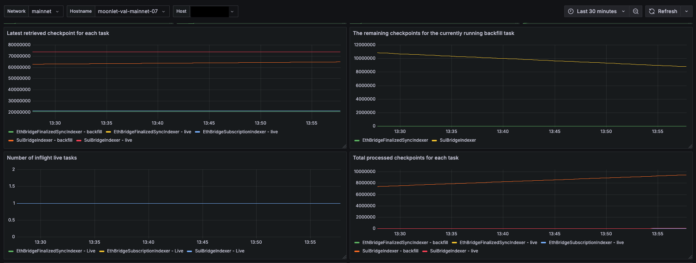

# Sui Bridge - Indexer Dashboard

This Grafana dashboard is designed to monitor the performance and status of the Sui Bridge Indexer. It provides real-time metrics and insights into bridge-related transactions, tasks, checkpoints, and the state of the Sui network using Prometheus as the data source.




# Alerting

I would suggest using the following alert condition to effectively monitor the SUI bridge indexer for any issues with data ingestion:

```
increase(data_ingestion_checkpoint{node_type = "bridge-indexer", network="mainnet", task="SuiBridgeIndexer - Live"}[5m]) < 0.1
```

This condition helps to detect a potential slowdown or halt in data ingestion by monitoring whether the increase in the checkpoint metric falls below 0.1 over a 5-minute period.


# More panels



Dashboard provided by [Moonlet](https://moonlet.io)