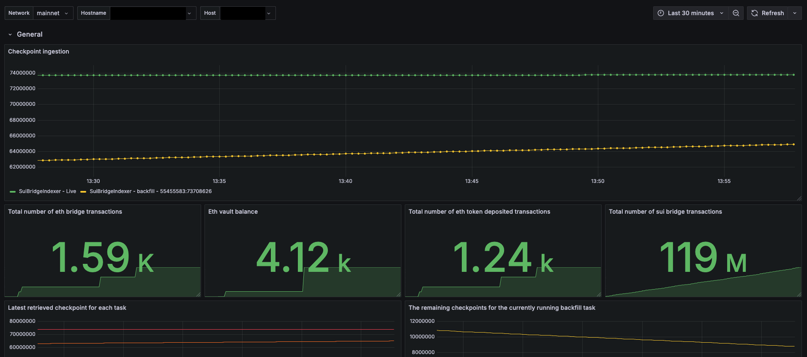
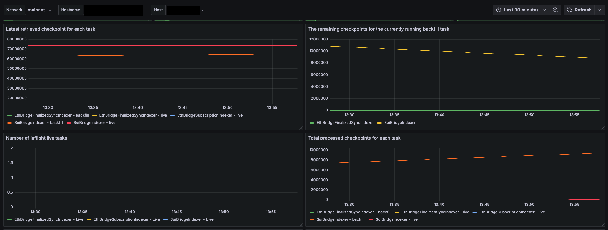
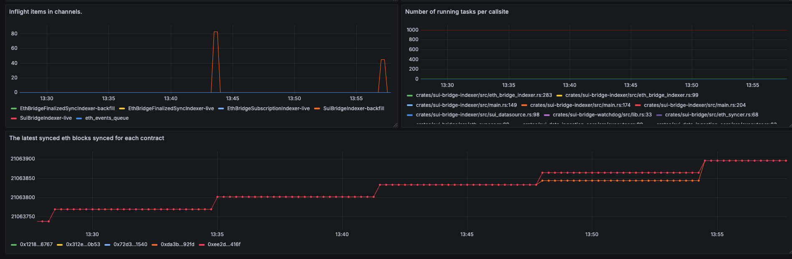
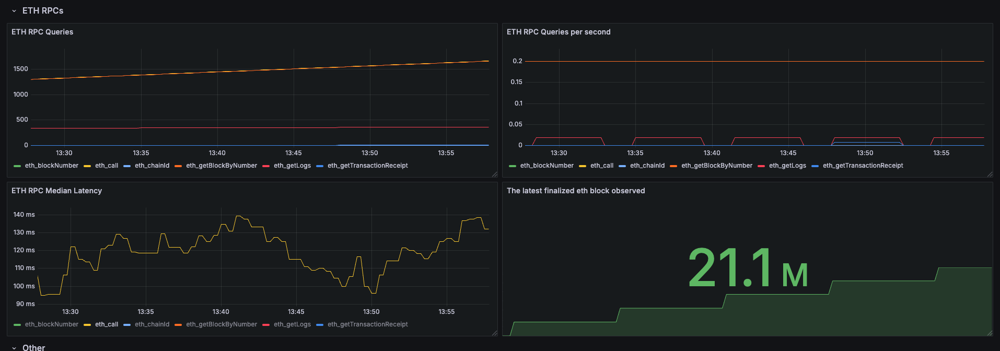

# Sui Bridge Indexer - Dashboard

This Grafana dashboard is designed to monitor the performance and status of the Sui Bridge Indexer. It provides real-time metrics and insights into bridge-related transactions, tasks, checkpoints, and the state of the Sui network using Prometheus as the data source.




# Alerting

I would suggest using the following alert condition to effectively monitor the SUI bridge indexer for any issues with data ingestion:

```
increase(data_ingestion_checkpoint{node_type = "bridge-indexer", network="mainnet", task="SuiBridgeIndexer - Live"}[5m]) < 0.1
```

This condition helps to detect a potential slowdown or halt in data ingestion by monitoring whether the increase in the checkpoint metric falls below 0.1 over a 5-minute period.


# More panels







# Run SUI bridge indexer using docker compose

- update `config.yml` 

```
---
remote_store_url: https://checkpoints.mainnet.sui.io
eth_rpc_url: [[ETH_RPC_URL]]
sui_rpc_url: [[SUI_RPC_URL]]

concurrency: 500
checkpoints_path: /home/sui-bridge-indexer/indexer-data

eth_sui_bridge_contract_address: 0xda3bD1fE1973470312db04551B65f401Bc8a92fD # <-- mainnet, 0xAE68F87938439afEEDd6552B0E83D2CbC2473623 for testnet
metric_port: 9185

sui_bridge_genesis_checkpoint: 55455583 # <-- mainnet, 43917829 for testnet
# genesis block number for eth
eth_bridge_genesis_block: 20811249 # <-- mainnet, 5997013 for testnet

eth_ws_url: [[ETH_WS_URL]]
```

- run using docker compose 

```
version: '3.7'

services:
  bridge-indexer:
    image: mysten/sui-tools:4e46da89efd5c5e59fe2b8e877bd960896601ec9
    container_name: bridge-indexer
    command: bridge-indexer --config-path /app/config.yaml
    volumes:
      - /home/sui-bridge-indexer/config.yaml:/app/config.yaml
    environment:
      - DB_URL=postgres://postgres:[[POSTGRES_USER]]@[[POSTGRES_PASSWORD]]:5432/bridge
    depends_on:
      - postgres
    ports:
      - 9185:9185
  postgres:
    image: postgres:13
    container_name: postgres
    restart: always
    environment:
      POSTGRES_USER: [[POSTGRES_USER]]
      POSTGRES_PASSWORD: [[POSTGRES_PASSWORD]]
      POSTGRES_DB: bridge
    volumes:
      - pgdata:/var/lib/postgresql/data
    ports:
      - 5432:5432

volumes:
  pgdata:
```


Dashboard provided by [Moonlet](https://moonlet.io)